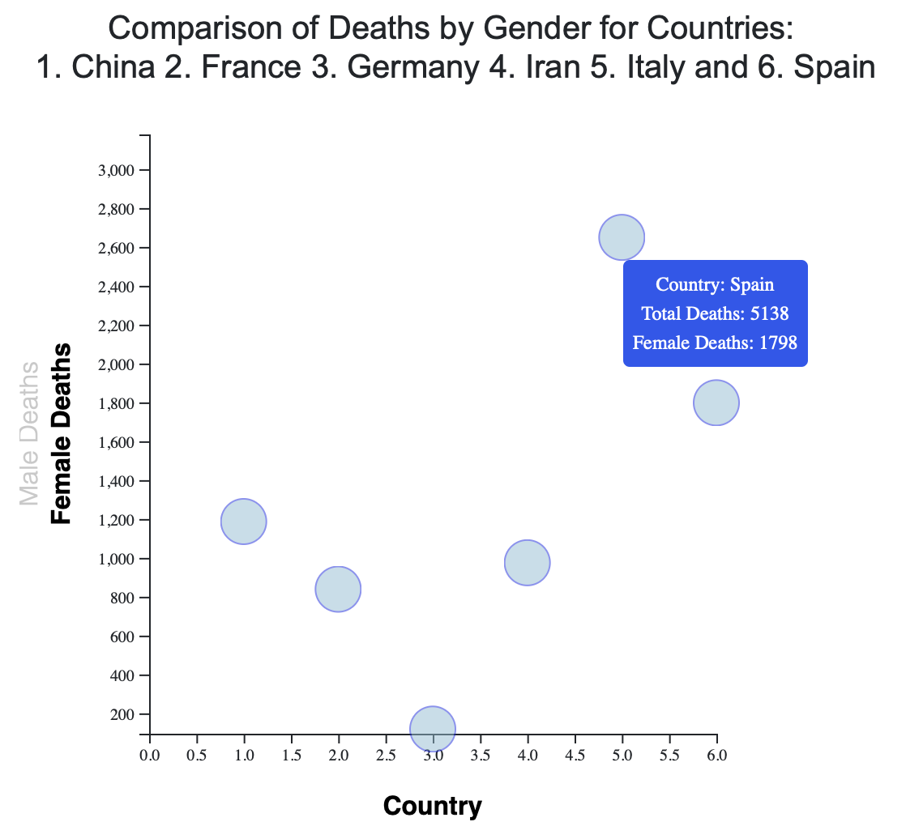

# Pandemic Analysis

Final group project in which the COVID-19 data were analyzed and trends were visualized using Python, Pandas, Machine Learning, Plotly, JavaScript, D3, Tableau and HTML/CSS. We examined the amount of cases and deaths that have been reported for every country, as well as compared the amount of cases per state within the United States. Moreover, we compared the gender demographics and death rates for people infected with this virus.

## Machine Learning Models:

Four models were created using supervised machine learning to analyze the relationship between the number of confirmed cases and the number of deaths/recovered cases for all countries, as well as the relationship between deaths and gender. Using linear regression and calculating the R-squared score, the relationship between these values was determined.

## Gender Comparison Using D3:

A scatterplot was created using JavaScript and D3 to compare the gender demographics and the total deaths for countries China, France, Germany, Iran, Italy and Spain. D3 was used for animations, transitions, click events on the y labels, and tooltips when the cursor hovers over the circles.

## Comparison of Confirmed Cases, Deaths and Recovered Cases Worldwide Using Tableau:

Visualization were created using Tableau to compare the total amount of confirmed cases, deaths and recovered cases worldwide. A second graph was created to compare the same factors for the countries with the highest numbers: China, France, Germany, Iran, Italy, Spain and the U.S. 

## Map of Cases in the U.S. Using JavaScript:

 state and county

n this assignment, an HTML page containing a dynamic table that displays UFO data was created. The table can be filtered by different criteria, and was created using JavaScript, HTML/CSS, and D3.

## Tracker and live Update: 

Visualization of cases around the world using a map. Tracks the number of cases, deaths, recovered cases, new cases and new deaths for every country using an API. 

